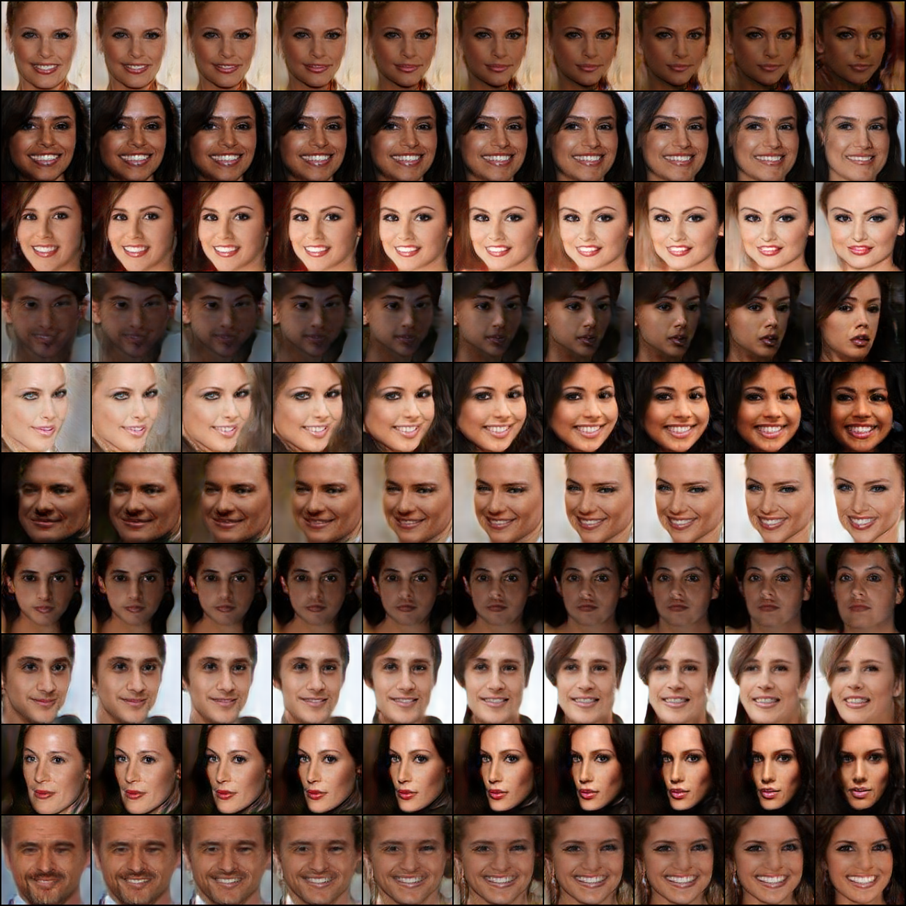
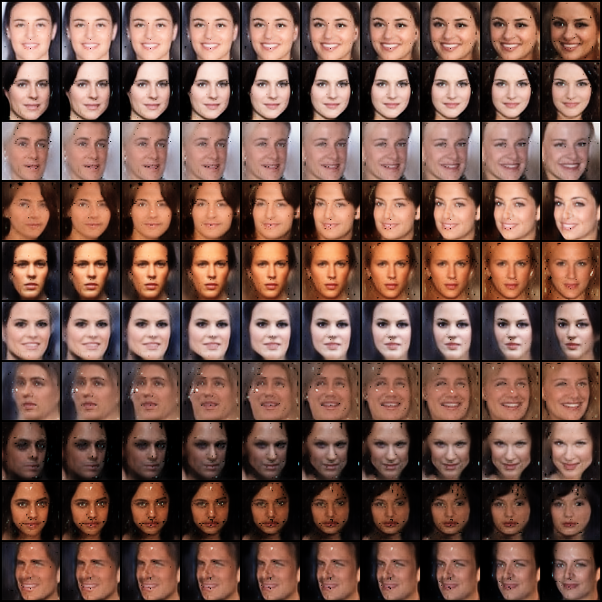
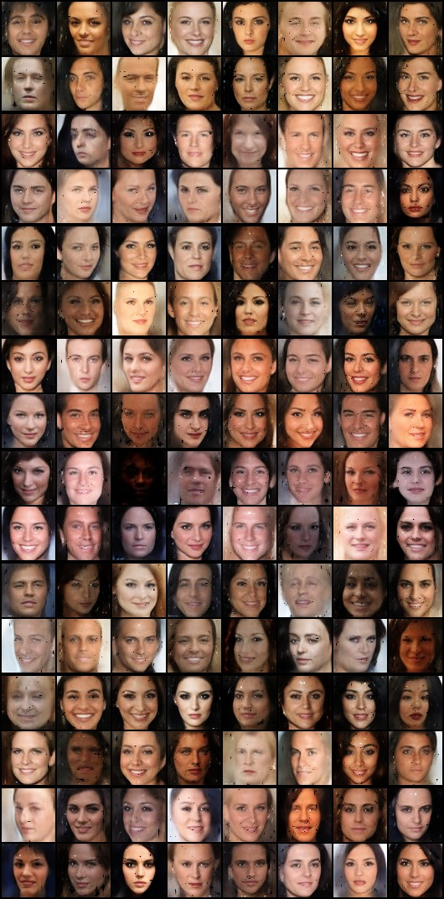
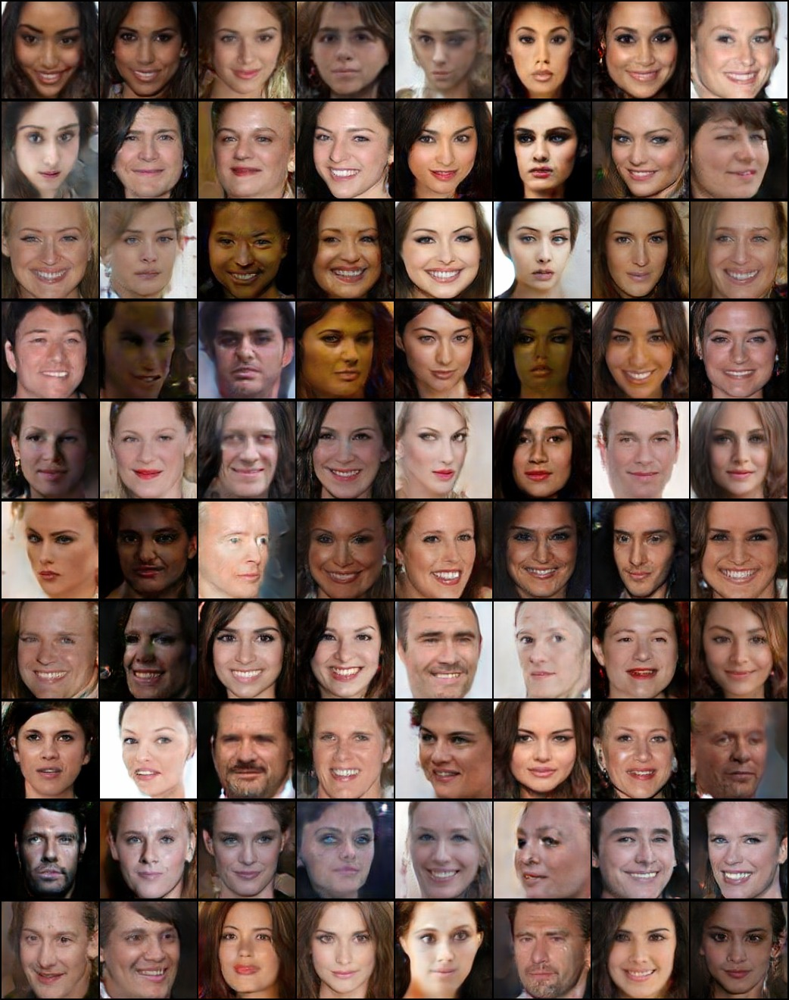

# Boundary Equilibrium GAN implementation in PyTorch

Paper is available in [arxiv](https://arxiv.org/abs/1703.10717).

### Usage
1. Download Algined and Cropped CelebA dataset.
2. Use the [face_detect](https://github.com/sunshineatnoon/Paper-Implementations/blob/ad23812046ae8fa6c9c16fd26a8b1a14b4c10a59/BEGAN/Data/face_detect.py) script to crop images.
3. To train the model, run the main script (Check flags for other tunable options):
```
    python main.py --cuda --base_path . --data_path <data_path> 
``` 
4. To generated interpolated results:
``` 
    python main.py --cuda --base_path . --load_step <saved epoch to load> --train 0
``` 
5. To use any pretrained models, just plug in `--base_path trained_models --model_name 128 --load step 208000` in the above step for model trained on 128x128 images.

### Results

Interpolation on 128x128 images after 206000 epochs:




Interpolation on 64x64 images after 97000 epochs:



Generated 64x64 images after 97k epochs:



Generated 128x128 images after 200k epochs:


